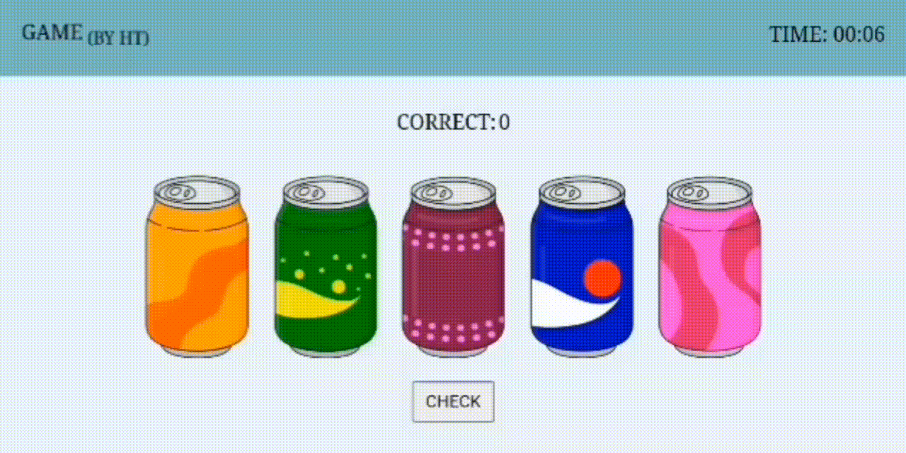
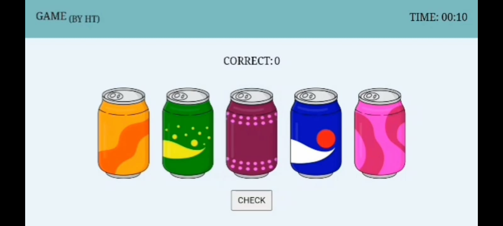
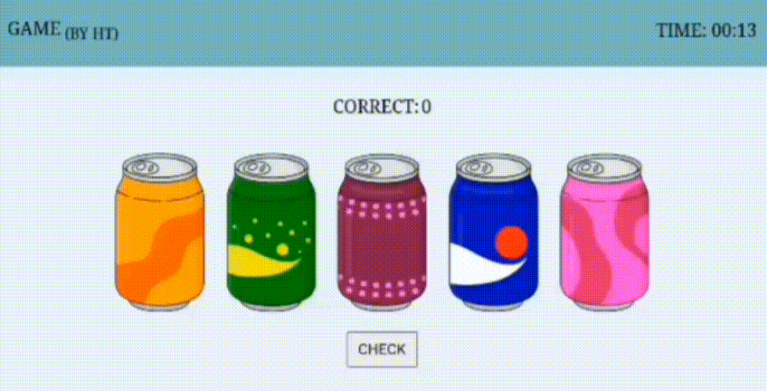
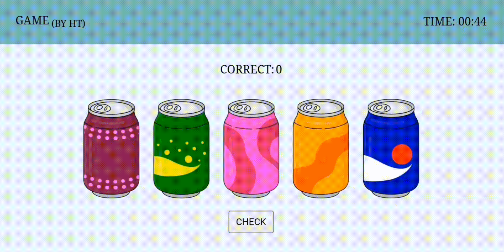
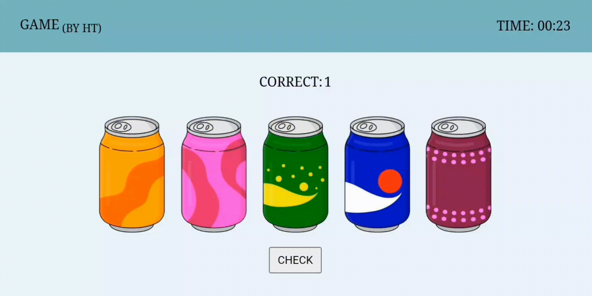

# Arrange The Cans
### How to play the game??
So first of all we will look at the game interface, here it is  
  
In the game there are 3 main parts first is the **Correct** counter, second one is the **Cans** and last one is the **Check** button.  

Now, aim of the game is to arrange the cans in correct order. The cans are randomly arranged in the game, you have to change the current position of the cans by selecting each and every can at a time and swipe them to left or right and arrange them in correct order.  
Following is the steps to play the game

#### 1. Selecting and Unselecting The Can
You can select and unselect the can by just clicking them.

This is selected can.  

This is unselected can.  

#### 2. Moving The Can
You can move the can by just selecting it and swiping over it to left or right.  

#### 3. Arranging Can In Correct Place
To check the correct place of the can wait actually u can not check the correct place of can directly but u can see how many cans are placed in correct order (above the cans in **Correct** part) so by swiping and checking number of cans placed in correct order u can find the correct place of the can and doing this for the every can u can arrange them in correct order. Just move the can and click on the **Check** button to check how many cans are in the correct order then shift right or left accordingly.  

That's it this is the game, further u start the game this are some tips and instructions to follow while playing this game,

### NOTE:
* You can swipe/shift the can to left or right only when it is selected and other cans which are not selected will not move from their places. To move the other can you have to unselect the selected can and then select the other can that u have to move.

* If the selected can is not moving even when ur swiping it, then unselect it and select it again then try to move it.

##### That's it in the game have fun by playing it I'll see u in the next game.
